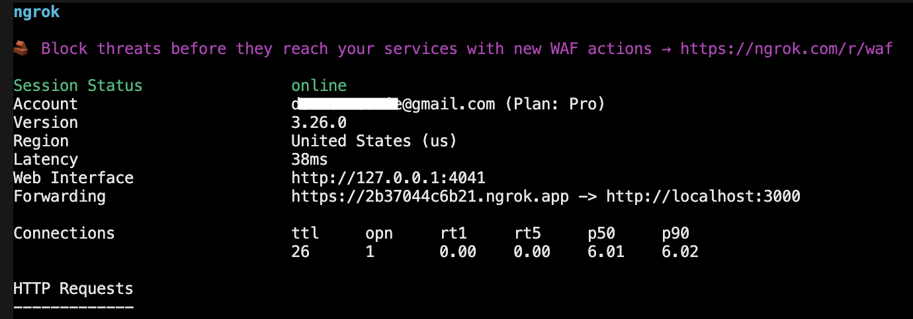

# Zoom Contact Center App SDK JavaScript sample

This repo is an HTML / CSS / JavaScript website that uses the Zoom Contact Center Apps to integrate a third party app into the Zoom client.

App has reference implementation for:

* Authentication flows: marketplace authentication, Zoom client deep linking
* REST API calls and retrieving user information
* Zoom Apps SDK app Context methods

---

## Start your Ngrok (reverse proxy)

Zoom Apps do not support localhost, and must be served over https. To develop locally, you need to tunnel traffic to this application via https, because the application runs in Docker containers serving traffic from `http://localhost`. You can use Ngrok to do this. Once installed you may run this command from your terminal:

```bash
ngrok http 3000
```

Ngrok will output the origin it has created for your tunnel, eg `https://9a20-38-99-100-7.ngrok.io`. You'll need to use this across your Zoom App configuration in the Zoom Marketplace (web) build flow (see below).

Please copy the https origin from the Ngrok terminal output and paste it in the `PUBLIC_URL` value in the `.env` file.



## Environment Variables

Create a `.env` file:

```env

ZOOM_CLIENT_ID=YOUR_CLIENT_ID_HERE
ZOOM_CLIENT_SECRET=YOUR_CLIENT_SECRET_HERE
ZOOM_REDIRECT_URI=https://example.ngrok.app/auth/callback
PORT=3000

```

## Getting Started

```bash
npm install
node server.js
```

### Deployment

The JavaScript Sample App can be easily deployed to [GitHub Pages](#github-pages), or [another static web hosting service](#other-static-web-hosting), like an AWS S3 bucket.


### GitHub Pages

1. Create a repo on [GitHub](https://github.com).

1. Add the remote to your project:

   `$ git remote add origin GITHUB_URL/GITHUB_USERNAME/GITHUB_REPO_NAME.git`

1. Git add, commit, and push your project:

   `$ git add -A`

   `$ git commit -m "deploying to github"`

   `$ git push origin master`

1. On GitHub, in your repo, navigate to the "settings" page, scroll down to the "GitHub Pages" section, and choose the "master branch folder" for the source.

1. Now your project will be deployed to https://GITHUB_USERNAME.github.io/GITHUB_REPO_NAME.

### Other Static Web Hosting

1. Deploy the directory to a static web hosting service, like an AWS S3 bucket.

## Need help?

If you're looking for help, try [Developer Support](https://devsupport.zoom.us) or our [Developer Forum](https://devforum.zoom.us). Priority support is also available with [Premier Developer Support](https://explore.zoom.us/docs/en-us/developer-support-plans.html) plans.